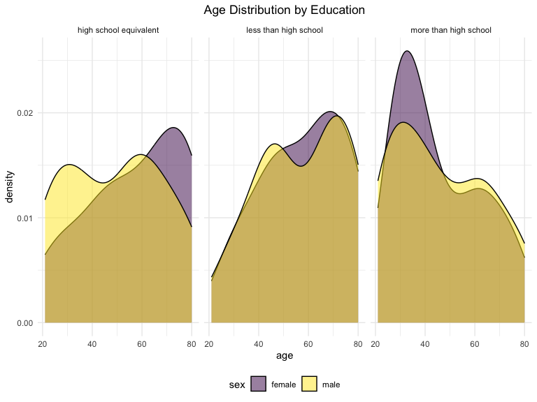
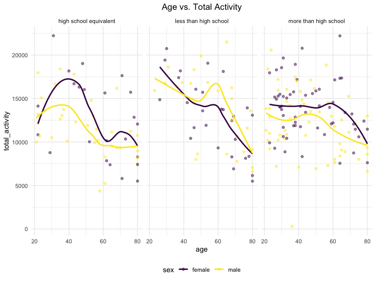

P8105 Homework 3
================
Hyun Kim (hk3373)
2024-10-11

# Problem 1

## Load NY NOAA data:

``` r
library(p8105.datasets)
data("ny_noaa")
str(ny_noaa)
```

    ## tibble [2,595,176 × 7] (S3: tbl_df/tbl/data.frame)
    ##  $ id  : chr [1:2595176] "US1NYAB0001" "US1NYAB0001" "US1NYAB0001" "US1NYAB0001" ...
    ##  $ date: Date[1:2595176], format: "2007-11-01" "2007-11-02" ...
    ##  $ prcp: int [1:2595176] NA NA NA NA NA NA NA NA NA NA ...
    ##  $ snow: int [1:2595176] NA NA NA NA NA NA NA NA NA NA ...
    ##  $ snwd: int [1:2595176] NA NA NA NA NA NA NA NA NA NA ...
    ##  $ tmax: chr [1:2595176] NA NA NA NA ...
    ##  $ tmin: chr [1:2595176] NA NA NA NA ...
    ##  - attr(*, "spec")=
    ##   .. cols(
    ##   ..   id = col_character(),
    ##   ..   date = col_date(format = ""),
    ##   ..   prcp = col_integer(),
    ##   ..   snow = col_integer(),
    ##   ..   snwd = col_integer(),
    ##   ..   tmax = col_character(),
    ##   ..   tmin = col_character()
    ##   .. )

The dataset has 2595176 rows and 7 columns, including id, tmax and tmin
as character variables, precipitation, snow as integer variables,and
date which is a date variable. There is a total of 3387623 NA values in
the dataset. Therefore, this could be an issue in data analysis since
there is a significant number of missing data.

## Tidy NY NOAA:

``` r
ny_noaa = ny_noaa |>
  drop_na() |>
  mutate(
    prcp = prcp / 10,
    tmax = as.integer(tmax) / 10,
    tmin = as.integer(tmin) / 10
  ) |>
  separate(date, 
           into = c("year", "month", "day"), 
           sep = "-",
           remove = FALSE) 
```

In tidying the dataset, the values of precipitation and temperature were
divided by 10 since they were in tenths of mm and degrees Celsius
respectively.

### For snowfall, what are the most commonly observed values? Why?

``` r
ny_noaa |>
  group_by(snow) |>
  summarize(count = n()) |>
  arrange(desc(count)) |>
  slice(1)
```

    ## # A tibble: 1 × 2
    ##    snow   count
    ##   <int>   <int>
    ## 1     0 1112758

For snowfall, the most commonly observed value is 0 because it only
snows in winter, but the dataset includes data from the other three
seasons when it most likely doesn’t snow.

## Average max temperature in January and July:

``` r
ny_noaa |>
  filter(month %in% c("01","07")) |>
  mutate(
    month = recode(month, "01" = "January"),
    month = recode(month, "07" = "July")
  ) |>
  group_by(id, year, month) |>
  summarize(average_tmax = round(mean(tmax), 2)) |>
  ggplot(aes(x = year, y = average_tmax, color = month)) +
  geom_point() +
  facet_grid(~month) +
  theme(axis.text.x = element_text(angle = 90)) +
  ggtitle("Average Max Temperature in January and July")
```

    ## `summarise()` has grouped output by 'id', 'year'. You can override using the
    ## `.groups` argument.

<!-- -->

### Is there any observable / interpretable structure? Any outliers?

The average max temperature is noticeably higher in July compared to
January obviously because it’s summer during July and winter during
January. Data for July 1988 has an extreme outlier. Data for January has
noticeable outliers for several years; the most extreme outliers are
shown in 1982 and 1996.

## tmax vs tmin and snowfall distribution by year:

``` r
tmax_vs_tmin = 
  ny_noaa |>
  ggplot(aes(x = tmax, y = tmin)) + 
  geom_hex() +
  ggtitle("tmax vs tmin")

snowfall_dist = 
  ny_noaa |>
  filter(snow > 0, snow < 100) |>
  ggplot(aes(x = snow, y = year)) + 
  geom_density_ridges(scale = 1.5) +
  ggtitle("Snowfall Distribution by Year")

tmax_vs_tmin + snowfall_dist
```

    ## Picking joint bandwidth of 4.24

<!-- -->

According to the figure above, the values of tmax are concentrated
around -5 to 30 degrees Celsius, while the values of tmin are
concentrated around -20 to 20 degrees. The distribution of snowfall for
all years are right skewed because it only snows during winter and it’s
subsequently more common for data in the dataset to have lower values of
snowfall overall.

# Problem 2

## Load, tidy and merge accelerometer datasets:

``` r
accel_df = read_csv(
  file = "./data/nhanes_accel.csv") |> 
  janitor::clean_names()
```

    ## Rows: 250 Columns: 1441
    ## ── Column specification ────────────────────────────────────────────────────────
    ## Delimiter: ","
    ## dbl (1441): SEQN, min1, min2, min3, min4, min5, min6, min7, min8, min9, min1...
    ## 
    ## ℹ Use `spec()` to retrieve the full column specification for this data.
    ## ℹ Specify the column types or set `show_col_types = FALSE` to quiet this message.

``` r
demographic_df = read_csv(
  file = "./data/nhanes_covar.csv",
  skip = 4,
  na = "NA") |> 
  janitor::clean_names() |>
  mutate(education = case_match(
             education,
             1 ~ "less than high school",
             2 ~ "high school equivalent",
             3 ~ "more than high school"),
         sex = case_match(
             sex,
             1 ~ "male",
             2 ~ "female"),
         education = as.factor(education),
         sex = as.factor(sex))
```

    ## Rows: 250 Columns: 5
    ## ── Column specification ────────────────────────────────────────────────────────
    ## Delimiter: ","
    ## dbl (5): SEQN, sex, age, BMI, education
    ## 
    ## ℹ Use `spec()` to retrieve the full column specification for this data.
    ## ℹ Specify the column types or set `show_col_types = FALSE` to quiet this message.

``` r
merged_accel_df = 
  left_join(accel_df, demographic_df, 
            by = join_by(seqn)) |>
  drop_na(sex, age, bmi, education) |>
  filter(age >= 21) |>
    pivot_longer(
    min1:min1440,
    names_to = "minute",
    names_prefix = "min",
    values_to = "activity") |>
  mutate(minute = as.numeric(minute))
```

## Number of men and women in each education category:

``` r
merged_accel_df |>
  distinct(seqn, .keep_all = TRUE) |>
  group_by(education, sex)|>
  summarize(num = n()) |>
  pivot_wider(
    names_from = "sex",
    values_from = "num"
  ) |> knitr::kable()
```

    ## `summarise()` has grouped output by 'education'. You can override using the
    ## `.groups` argument.

| education              | female | male |
|:-----------------------|-------:|-----:|
| high school equivalent |     23 |   35 |
| less than high school  |     28 |   27 |
| more than high school  |     59 |   56 |

Approximately half of the participants have education more than high
school. Also, for high school equivalent education, there are noticeably
more males than females compared to the other two education levels.

## Age distribution of men and women in each education category:

``` r
merged_accel_df |>
  distinct(seqn, .keep_all = TRUE) |>
  ggplot(aes(x = age, fill = sex)) +
  geom_density(alpha = .5) +
  facet_grid(~education) +
  ggtitle("Age Distribution by Education")
```

<!-- -->

The distributions for females with education less than high school and
high school equivalent are left skewed; however, the distributions for
males with both educations are bimodal. On the other hand, the
distribution for both females and males with education more than high
school is right skewed.

## Aggregate accross minute and plot total activities vs age:

``` r
merged_accel_df |>
  group_by(seqn, sex, age, education) |>
  summarize(total_activity = sum(activity)) |>
  ggplot(aes(x = age, y = total_activity, color = sex)) +
  geom_point(alpha = .5) +
  geom_smooth(se = FALSE) +
  facet_grid(~education) +
  ggtitle("Age vs. Total Activity")
```

    ## `summarise()` has grouped output by 'seqn', 'sex', 'age'. You can override
    ## using the `.groups` argument.
    ## `geom_smooth()` using method = 'loess' and formula = 'y ~ x'

<!-- -->

Total activity generally decreases as age increases, which is more
noticable for less than high school and high school equivalent
education, but less apparent in education more than high school. For
data of male who has high school equivalent education, total activity
increases until 40 and declines afterwards.

## Plot 24-hour activity time courses for each eduction level:

``` r
merged_accel_df |>
  arrange(minute) |>
  mutate(hour = rep(1:24, each = 13680)) |>
  group_by(seqn, sex, education, hour) |>
  summarize(activity = sum(activity)) |>
  ggplot(aes(y = activity, x = hour, color = sex)) +
  geom_point(size = .2, alpha = .5) +
  geom_smooth(se = FALSE) +
  facet_grid(~education)  +
  ggtitle("24-Hour Activity Time Course by Education")
```

    ## `summarise()` has grouped output by 'seqn', 'sex', 'education'. You can
    ## override using the `.groups` argument.
    ## `geom_smooth()` using method = 'gam' and formula = 'y ~ s(x, bs = "cs")'

<!-- -->

For all education and sex, activity sharply increases after 5 AM when
people start waking up possibly due to work and exercise and declines at
8 PM when people usually get back home from outdoor activities and start
sleeping. Also, there is one extreme outlier for activity data of male
who has more than high school education, which makes the range of the
plot’s y axis large for this three-panel plot.
